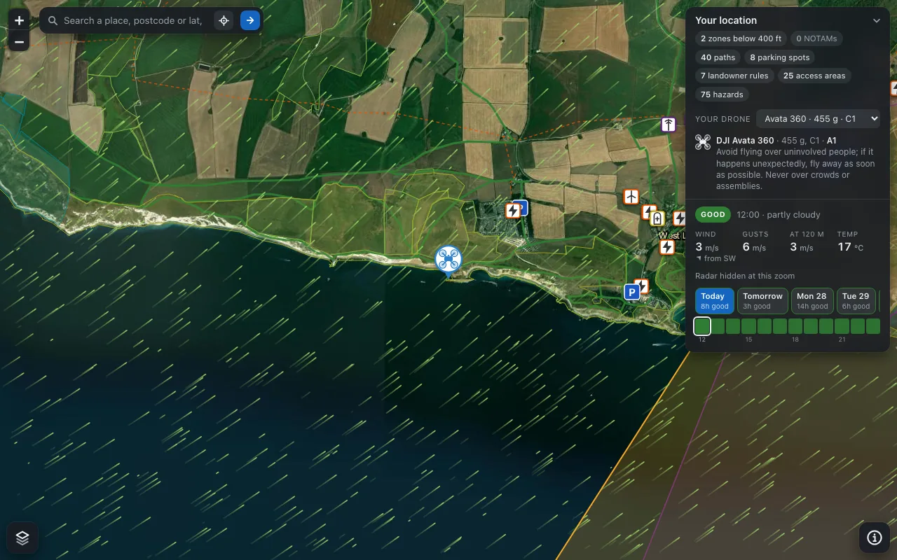
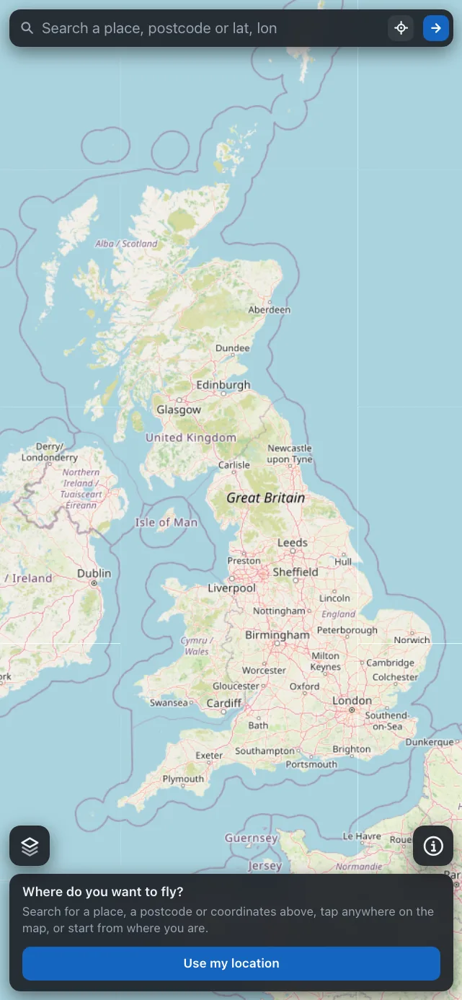
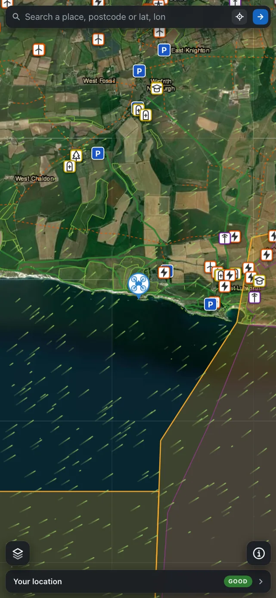
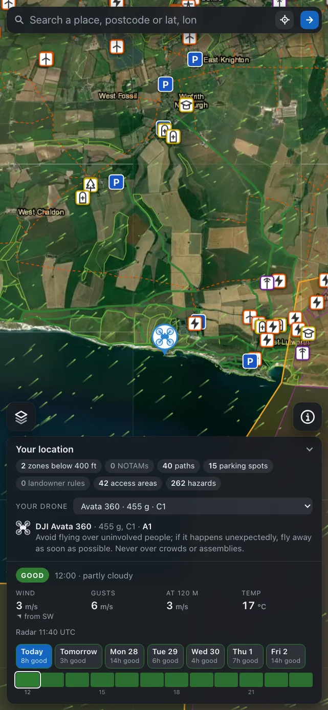

#  FPV Airspace

An MCP server and map that answer the question existing airspace tools do not: **can I legally take off and fly a drone here, in the UK?**

<p align="center"></p>

Airspace restriction data is the easy half. A UK pilot actually has to clear three layers: permanent airspace restrictions (aerodrome flight restriction zones, prohibited, restricted and danger areas, the 400 m zone around every prison), temporary restrictions (NOTAMs), and landowner rules (National Trust byelaws, Forestry England permits, council park byelaws). The practical workaround pilots use is launching from a public right of way, where no landowner permission is needed. This server puts all of that behind thirteen tools that take a place name, a postcode or coordinates, covers England, Wales, Scotland and Northern Ireland, and draws it on a map that Claude can show inline or that you can open on a phone.

Informational only. It is not a substitute for a NATS pre-flight briefing, the CAA Drone Code, or permission from the landowner and any relevant aerodrome.

[](https://github.com/sponsors/noodlemctwoodle)

FPV Airspace is free and stays free: the data licences it relies on are for non-commercial use, so nothing is ever paywalled. If it saves you a wasted trip, a [one-off donation](https://donate.stripe.com/3cI28sesu6T0f4n7IP2Nq00) or [sponsoring on GitHub](https://github.com/sponsors/noodlemctwoodle) helps cover the hosting and the weather API.

## What it answers

- **Is this point inside a restriction?** `check_location`: a one-line verdict and every zone containing the point, prisons included.
- **What is this aerodrome's zone?** `get_aerodrome_zone` by name or ICAO code.
- **Is there a NOTAM in force?** `check_notams` from the live NATS bulletin; unplaceable NOTAMs are listed, never dropped.
- **What does my route cross?** `check_route` for waypoints or an area, with the distance at which each zone is entered.
- **Can I take off here?** `check_takeoff_site`: nearest rights of way, parking, ground hazards, landowner rules, access land, designations and the council at the point.
- **Where can I park?** `find_parking` from OpenStreetMap, nearest first.
- **Can I fly here, now?** `preflight_briefing`: one GO, CAUTION or NO-GO with reasons from airspace, NOTAMs, weather, geomagnetic activity, paths, parking and your drone's rules.
- **What is the ground doing?** `check_terrain` against the 120 m rule along a route or around a point.
- **Where could I take off?** `find_takeoff_spots` scores and ranks candidate spots, and the map numbers them.
- **What can my drone do?** `check_drone_rules`: subcategory, separation, registration and Remote ID under the CAA class mark rules.
- **Is the weather flyable?** `check_weather`: hourly ratings against small-drone limits, plus the K-index.
- **Show me.** Every location answer on the hosted server carries a map that Claude renders inline.
- Plus `geocode` and `get_data_status`. Arguments and examples for each are in [docs/tools.md](docs/tools.md).

## Quick start

Requires Node 22.13 or newer (the server uses Node's built-in SQLite, so there is nothing native to compile). The package is a single bundled file with no dependencies, so `npx` starts it in a few seconds.

```bash
npx -y fpv-airspace
```

### Claude Desktop

Add to `claude_desktop_config.json` (Settings > Developer > Edit Config):

```json
{
  "mcpServers": {
    "fpv-airspace": {
      "command": "npx",
      "args": ["-y", "fpv-airspace"],
      "env": {
        "OS_NAMES_API_KEY": ""
      }
    }
  }
}
```

`OS_NAMES_API_KEY` is optional. Without it, geocoding uses OpenStreetMap's Nominatim. With a free key from the [OS Data Hub](https://osdatahub.os.uk/), Ordnance Survey place names are tried first.

On first use the server downloads the current airspace data pack (about 195 MB compressed, 527 MB on disk: 1,069 restriction zones, 520,000 rights of way, 94,000 landowner and designation polygons, 586,000 parking spots and 816,000 ground hazards) into `~/.cache/fpv-airspace` and reports progress on stderr. NOTAM and geocoding tools work while it downloads. The pack is refreshed automatically when a new AIRAC cycle is published.

### Claude Desktop extension (.mcpb)

Each release also ships `fpv-airspace.mcpb`. Download it from the [releases page](https://github.com/noodlemctwoodle/fpv-airspace/releases), double-click it, and Claude Desktop installs the server with its bundled Node runtime and a settings panel for the optional OS Names key.

### Claude Code

```bash
claude mcp add fpv-airspace -- npx -y fpv-airspace
```

### Remote connector (Claude web, mobile and voice)

The same server runs as a Cloudflare Worker at **`https://fpv-airspace.fetchlabs.co.uk/mcp`**, which is what Claude's mobile app and voice mode can reach: they cannot run local servers, only remote connectors. Add it on claude.ai under Settings > Connectors > Add custom connector with that URL, and it becomes available on every surface, including voice conversations. Every tool accepts `format: "brief"`, which returns two or three spoken-friendly sentences instead of the full report.

Running your own copy, on Cloudflare or as plain streamable HTTP or Docker, is covered in [docs/hosting.md](docs/hosting.md).

## The map

<table align="center"><tr>
<td></td>
<td></td>
<td></td>
</tr></table>

Search a place, tap the map or use your position; every zone, NOTAM, path, landowner rule, parking spot and ground hazard in view is drawn with its own icon, a long press lists what is under a point, the card shows the coming week's flyability hour by hour, and the overlays load as you pan. Claude renders the same map inline with an answer. The full guide, with the layers key and more screenshots, is in [docs/map.md](docs/map.md).

## Documentation

- [Tools](docs/tools.md): every tool, its arguments and example prompts.
- [The map](docs/map.md): search, layers, hazards, weather, the phone layout and URL parameters.
- [Data sources and attribution](docs/data-sources.md): where each layer comes from, how often it refreshes and under what licence.
- [Configuration](docs/configuration.md): environment variables for the server and the build.
- [Hosting](docs/hosting.md): Cloudflare Worker, streamable HTTP and Docker.
- [Development](docs/development.md): tests, packs and releases.

## Caveats

- Rights-of-way data is an interpretation of each council's Definitive Map, not the Definitive Map itself, and covers England and Wales. Scotland has no definitive map (access rights apply instead, and core paths need a Spatial Hub key) and Northern Ireland has no definitive map either: only councils that publish their asserted paths appear, so absence there means unknown; the tools say so.
- The landowner rule layer holds National Trust and Forestry England land and a hand-curated list of council byelaws and policies. The National Trust's open data omits its Northern Ireland properties. Absence of a rule never means take-off is permitted.
- Ground hazards and parking come from OpenStreetMap and are as complete as the map is; they are advisory and never change a verdict.
- Only zones reaching below 400 ft (120 m) count towards a verdict; higher zones are listed on request.
- NOTAMs are read from the NATS contingency bulletin, which may lag the live system by up to an hour.
- ICAO codes for aerodromes come from a curated table covering major and well-known UK aerodromes; lookups by name always work.

## Licence

MIT. Data sources carry their own licences; see the [licences](licences/) folder.
