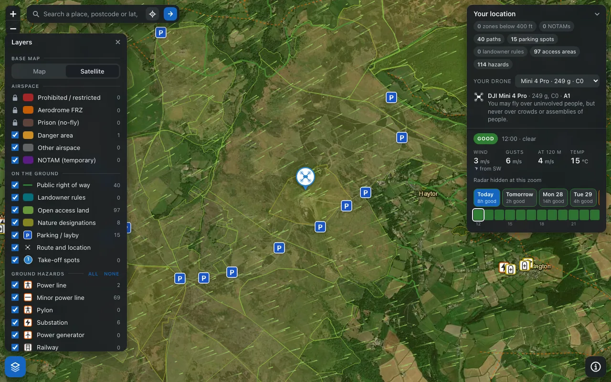
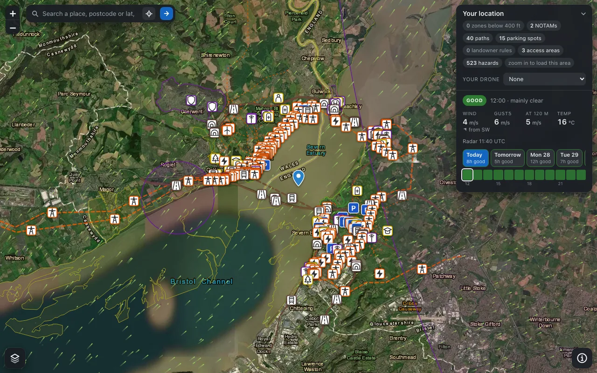
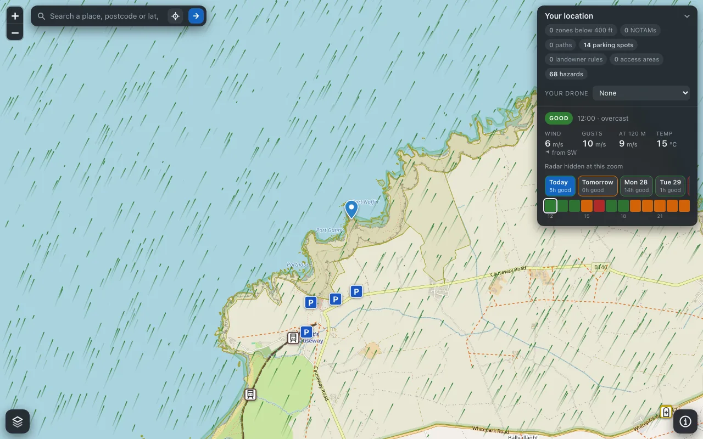

# The map

Back to the [README](../README.md).

The hosted server serves the same map three ways: inline in Claude as an MCP App (Claude web, desktop and mobile render it with the answer; Claude Code shows the text only), as a standalone page at `GET /map`, and as the JSON behind it at `GET /api/view`. Every location tool on the hosted server returns a map link and the view descriptor the app needs; geometry only ever travels through `/api/view`, so tool results stay small.

**Finding a place.** The search box takes a place name, a postcode or `lat, lon` and calls `GET /api/geocode?q=`, the same resolver the tools use: a confident match moves the map, an ambiguous name shows the candidates to pick from, and nothing is ever guessed. The locate button uses the browser's position. Tapping or clicking anywhere on the map checks that point, and a long press (right click on a desktop) lists everything drawn under the point, since a NOTAM or aerodrome zone often covers the whole view. Pan or zoom away and the overlays for the new area load on their own, while the chosen point, its weather and the URL stay put; the URL updates as you search, so it can be shared. Parking, take-off spot and location popups carry a Directions link that opens the device's own maps app: Apple Maps on an iPhone, the maps chooser on Android, Google Maps in a new tab on a desktop.

**Layers.** The layers button opens a panel with Map or Satellite base layers (Esri World Imagery with a place-name overlay; `basemap=satellite` opens in that view) and a toggle for every overlay, grouped into Airspace (each zone class and NOTAMs), On the ground (rights of way, landowner land, open access land, nature designations, parking, route, take-off spots), Ground hazards (one row per kind with its icon and count, and All or None shortcuts) and Weather. Prohibited and restricted areas, aerodrome FRZs and prison zones are always drawn and cannot be switched off. Choices are remembered per browser, and `ui=layers` or `ui=info` on the URL opens a panel for a shared link.

**Ground hazards.** Nineteen kinds from OpenStreetMap, each with its own icon in the style of a road sign: railways, motorways, trunk roads and bridges; power lines, minor lines, pylons, substations and generators; helipads, masts and military land; and the places people gather, schools, nurseries, hospitals, fire and fuel stations, parks and cemeteries. Line hazards carry their icon at intervals along the line, so a motorway reads as one at any zoom. A wide view keeps every line and the 600 nearest point hazards, so nothing you have toggled on goes missing as you pan.

**Weather.** Three toggles: Conditions now (the Open-Meteo flyability rating for the coming hour, including the wind at 120 m), Wind flow (animated streamlines over the visible map, coloured by the advisory thresholds, paused while you drag; a still frame when the browser prefers reduced motion) and Rain radar (the latest RainViewer frame, coarse at about 600 m per pixel on the free tier). The location card also carries a timeline: a pill per day for the coming week coloured by its best daylight rating with the count of good hours, and an hour strip for the chosen day; tap a day to jump to its first good hour and an hour to see its wind, gusts, 120 m wind, temperature and the reasons for its rating. `weather=0` on `/api/view` skips the forecast.

<table align="center"><tr>
<td></td>
<td></td>
<td></td>
</tr></table>

**On a phone** the search bar spans the top, the location card is a collapsible sheet at the bottom, the layers panel opens as a sheet from the same button, pinch replaces the zoom buttons, and a page opened without a location invites a search, a tap or your position. Opening the worker's root URL in a browser lands on the map.

**Your drone.** The location card has a picker fed by `GET /api/drones` (the catalogue with each model's rules summary and a drawn silhouette). Choosing a model makes it the location marker and the key swatch, and shows its subcategory and overflight rule in the card. Add `drone=<catalogue id>` to the `/map` URL to preselect one; `check_takeoff_site` called with a `drone` does this for the MCP App. The silhouettes are original drawings, one per family (palm, mini, air, mavic, fpv, phantom), because manufacturer photographs are copyrighted.

`GET /api/wind?bbox=w,s,e,n&z=` serves the wind field (one Open-Meteo request per view, snapped to a fixed lattice of at most 64 points and cached per point).

Map tiles © OpenStreetMap contributors; imagery © Esri, Maxar, Earthstar Geographics, and the GIS User Community; rain radar © RainViewer; weather © Open-Meteo.com (CC BY 4.0).

